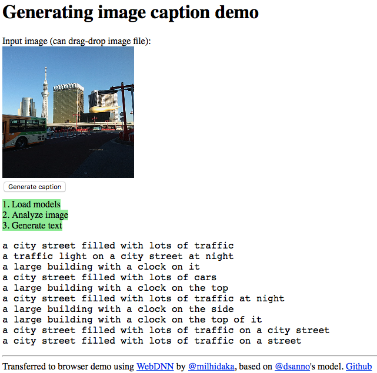

# Image caption generator using Chainer

Python 3 and ResNet feature version by @milhidaka

Including caption generation [demo on web browser](https://milhidaka.github.io/chainer-image-caption/) using [WebDNN](https://github.com/mil-tokyo/webdnn).



# Requirement

* Python 3.6
* [Chainer 2.0.0](http://chainer.org/)
* [Cupy 1.0.0](http://docs.cupy.chainer.org/en/stable/)
* [Pillow](https://pypi.python.org/pypi/Pillow/)

# Usage (only caption generation)

## Simply doing caption generation using pre-trained model (ResNet-50 + MSCOCO)
Download [caption_gen_resnet.model](https://drive.google.com/file/d/0BxKvBdxU_LchXzJqRTZBMU5SUVE/view?usp=sharing) (45MB) and [dataset_coco.pkl](https://drive.google.com/file/d/0BxKvBdxU_LchNmhmVHBRZ1laUkk/view?usp=sharing) (28MB).

```
$ python src/generate_caption.py -s dataset_coco.pkl -m caption_gen_resnet.model -l image/list.txt -g 0
```

Options:
* -s, sentence: (required) sentence dataset file path.
* -m, --model: (required) trained model file path.
* -l, --list: (required) image path list file.
* -g, --gpu: (optional) GPU index. -1 means CPU.

## Convert model to WebDNN (browser demo)

```
$ python src/convert_webdnn.py --sentence dataset_coco.pkl --model caption_gen_resnet.model --example_image image/asakusa.jpg
```

Then start a HTTP server (`python -m http.server`) and go to [http://localhost:8000/webdnn](http://localhost:8000/webdnn).

# Usage (training model using MSCOCO dataset)

## Download dataset

1. Download images (2014) from http://mscoco.org/dataset/#download and extract to some directory.
1. Download [caption_datasets.zip](http://cs.stanford.edu/people/karpathy/deepimagesent/caption_datasets.zip) from:
http://cs.stanford.edu/people/karpathy/deepimagesent/
1. Extract downloaded zip file, and you'll get dataset_coco.json.

## Convert dataset

```
$ python src/convert_dataset.py dataset_coco.json dataset_coco.pkl
```

Parameters:
* sentence JSON file of dataset.
* output pkl file.

## Extract ResNet feature

```
$ python src/extract_resnet_feat.py dataset_coco.json /path/to/coco/images resnet_feat.mat -g 0 -b 16
```

Options:
* sentence JSON file of dataset.
* Top-level directory containing images. Searches files recursively.
* output feature matrix file. (becomes about 1GB)
* -g, --gpu: (optional) GPU index. -1 means CPU.
* -b, --batchsize: (optional) batch size for extracting feature.

It will take several hours.

## Train dataset

```
$ python src/train.py -g 0 -s dataset_coco.pkl -i resnet_feats.mat -o model/caption_gen
```

Options:
* -g, --gpu: (optional) GPU device index (default: -1).
* -s, --sentence: (required) sentence dataset file path.
* -i, --image: (required) image feature file path.
* -m, --model: (optional) input model file path without extension.
* -o, --output: (required) output model file path without extension.
* --iter: (optional) the number of iterations (default: 100).

### Image path list file sample

```
image/asakusa.jpg
image/tree.jpg
```

# License

MIT License
